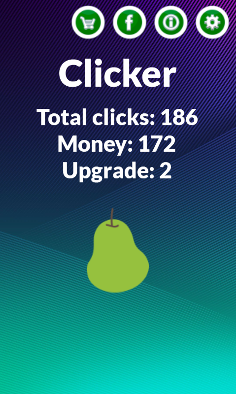

# Clicker-Solar2D
A mobile clicker game made in Solar2D

### About
-------------
This is one my mobile games made with Solar2D. It's a simple food clicker. You tap food, you earn points and you upgrade.  
You can buy different things with points, not only different food types but also other tracks and backgrounds.  
I wish I added more animations into this, cause it looks kinda boring. Maybe one day I'll get back to it.  

This is more of a preserving repo. It's always fun to look back at older projects and think about how I would approach them now.  
If you want to improve upon this code, feel free to do so :)

### Getting Started
-------------
To run this project, you will need the latest version of Solar2D (https://docs.coronalabs.com/guide/start/installWin/index.html).   
To build the game, use this guide (https://docs.coronalabs.com/guide/distribution/androidBuild/index.html)  
You're free to modify the project as you wish.

WARNING: I have not tested this game on any iOS or Windows Phone devices (but who uses the second ones anyway?). The game was only tested on a few Android phones.

### Preview
-------------

